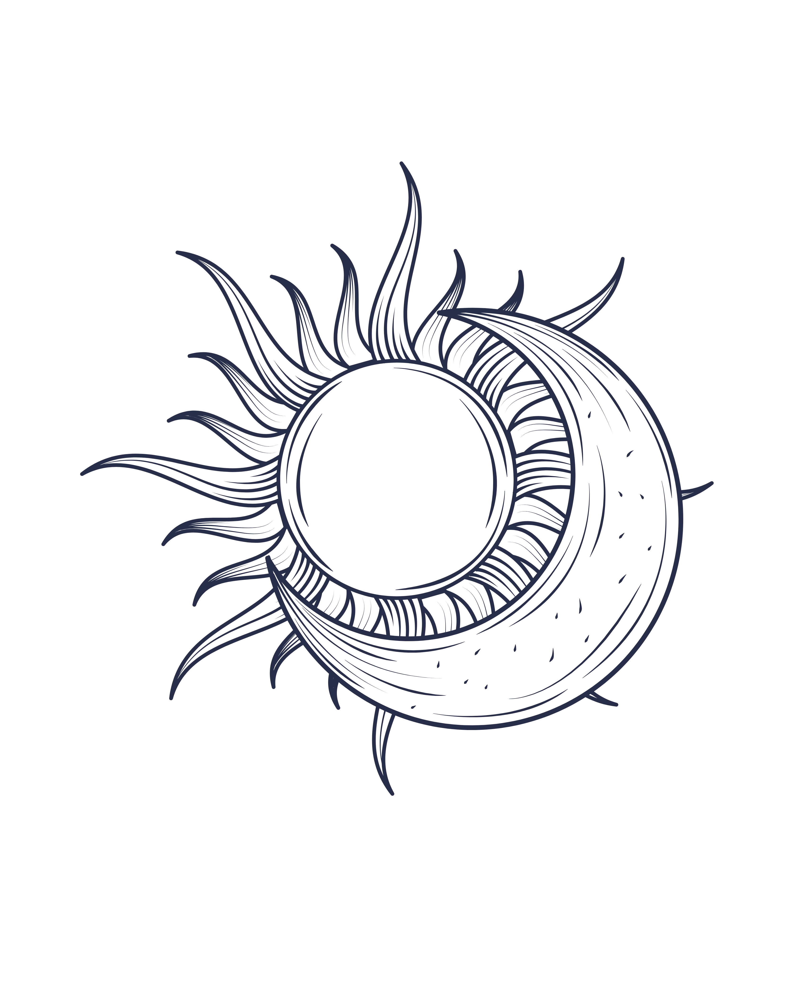

# Tahák: použité části kódu v projektu

Tento soubor je přehled toho, co se v projektu opravdu používá.
Je rozdělený na HTML, CSS a JavaScript.

Cílem je ne jen vyjmenovat názvy technologií, ale ukázat, jak se to v projektu používá v praxi, na konkrétních typech prvků a strukturách z webu.

## 1) HTML elementy (tagy) a jejich význam v tomto projektu

### Základní struktura dokumentu

- `html` - kořen celého HTML dokumentu.
- `head` - metadata stránky: titulek, CSS, SEO, sociální meta tagy, skripty.
- `title` - název stránky v záložce prohlížeče.
- `meta` - technické informace (kódování, viewport, SEO, Open Graph, bezpečnostní hlavičky).
- `link` - připojení externích souborů, například CSS, fontů nebo faviconu.
- `script` - JavaScript kód nebo externí skript.
- `body` - viditelný obsah stránky.

Příklad z projektu:

```html
<head>
  <meta charset="UTF-8" />
  <meta name="viewport" content="width=device-width, initial-scale=1" />
  <title>Aura Michaell Massage</title>
  <link rel="stylesheet" href="style.css" />
  <script src="https://cdnjs.cloudflare.com/ajax/libs/three.js/r128/three.min.js"></script>
</head>
```

### Obsahové bloky

- `header` - hlavička sekce nebo stránky.
- `nav` - navigace (menu, odkazy, dropdown).
- `main` - hlavní obsah stránky.
- `section` - tematický blok obsahu.
- `article` - samostatný informační blok, například karta služby, článek nebo panel.
- `footer` - patička stránky.
- `div` - univerzální kontejner pro layout a skupiny prvků.
- `span` - řádkový kontejner na text nebo menší části obsahu.

Příklad z projektu:

```html
<nav class="primary-nav premium-theme" aria-label="Hlavní navigace">
  <div class="primary-nav__inner">
    <a href="#hero" class="primary-nav__brand">Aura Michaell Massage</a>
    <button class="primary-nav__toggle" type="button">Menu</button>
  </div>
</nav>
```

### Text a odkazy

- `h1`, `h2`, `h3`, `h4` - nadpisy různých úrovní.
- `p` - odstavec textu.
- `a` - odkaz.
- `strong` - důležitý text, zvýraznění významu.
- `br` - nový řádek.
- `ul`, `ol`, `li` - seznamy a jejich položky.

Příklad:

```html
<h1 class="main-title-text">AURA<br>MICHAELL<br>MASSAGE</h1>
<p>V salonu vytvářím prostředí, kde se zavřou dveře před každodenním shonem.</p>
<ul class="welcome-list">
  <li>Usadím Vás a nabídnu čaj.</li>
  <li>Společně si popovídáme.</li>
</ul>
```

### Obrázky, média a mapy

- `img` - obrázek.
- `picture` - varianta pro více zdrojů (např. WebP + fallback).
- `source` - zdroj média pro `audio`, `video` nebo `picture`.
- `iframe` - vložený obsah, například mapa Google Maps.
- `audio` - zvukový obsah.
- `noscript` - obsah pro prohlížeče s vypnutým JavaScriptem.
- `svg` - vektorová grafika.
- `path`, `circle`, `g` - jednotlivé části SVG.

Příklad z projektu:

```html
<div class="home-offer-location__map">
  <iframe src="https://www.google.com/maps/embed?..." allowfullscreen loading="lazy"></iframe>
</div>


```

### Formuláře a interaktivní prvky

- `button` - klikací tlačítko.
- `details` / `summary` - rozbalovací sekce.
- `label` - popisek pro formulář.
- `input`, `textarea` - pole pro zadávání dat.

Tady v projektu se používá hlavně `button` pro menu, zobrazení dropdownu, scroll nahoru, hudbu a CTA tlačítka.

## 2) HTML atributy (co se v projektu používá)

### Základní atributy

- `class` - přiřazení CSS tříd. Např. `class="primary-nav__link"`.
- `id` - unikátní identifikátor prvku. Např. `id="hero"`, `id="scrollTopBtn"`.
- `style` - inline CSS přímo na prvku; používá se občas pro jednoduché jednorázové úpravy.
- `lang` - jazyk dokumentu: `lang="cs"`
- `charset` - znaková sada: `charset="UTF-8"`
- `name`, `content`, `http-equiv`, `property` - metadata pro SEO, sociální sítě a prohlížeče.

### Odkazy a média

- `href` - adresa odkazu.
- `target="_blank"` - otevření odkazu v novém okně.
- `rel="noopener noreferrer"` - bezpečnostní nastavení externích odkazů.
- `src` - zdroj obrázku, skriptu, zvuku, iframe.
- `srcset`, `sizes` - responzivní obrázky.
- `alt` - alternativní text obrázku.
- `loading`, `decoding`, `fetchpriority` - optimalizace načítání obrazů.
- `width`, `height` - rozměry prvku.

Příklad:

```html
<a href="https://aura-michaell-massage.reservio.com" target="_blank" rel="noopener noreferrer">
  Rezervace
</a>


```

### Přístupnost a interakce

- `aria-label` - popis pro čtečky obrazovky.
- `aria-expanded` - zda je prvek rozbalený.
- `aria-controls` - propojení s ovládaným obsahem.
- `aria-hidden` - skrytí prvku pro asistivní technologie.
- `role` - role elementu.
- `title` - krátký tooltip.
- `type="button"` - tlačítko bez implicitního submitu.

Příklad z projektu:

```html
<button class="primary-nav__toggle" type="button" aria-expanded="false" aria-controls="primary-nav-menu">
  Menu
</button>
```

### Data a vlastní atributy

- `data-*` - vlastní data, která JavaScript čte a mění podle nich chování.

Příklady:

```html
<button class="primary-nav__toggle" data-nav-toggle>
  <span class="primary-nav__toggle-icon"></span>
</button>
```

Díky `data-nav-toggle` JavaScript ví, které tlačítko ovládat.

### SVG atributy

- `viewBox` - oblast vykreslení SVG.
- `xmlns` - XML namespace.
- `fill`, `stroke`, `stroke-width`, `stroke-linecap` - vzhled čar a tvarů.
- `d` - data cesty v SVG.

Příklad z dropdownu v navigaci:

```html
<svg class="primary-nav__dropdown-arrow" viewBox="0 0 12 8" aria-hidden="true">
  <path d="M1 1L6 6L11 1" stroke="currentColor" stroke-width="2" stroke-linecap="round" />
</svg>
```

## 3) CSS vlastnosti (použité v projektu)

### Rozměry a box model

- `width`, `height` - šířka a výška.
- `max-width`, `min-height` - omezení rozměrů.
- `margin`, `padding` - vnější a vnitřní odsazení.
- `box-sizing: border-box` - šířka a výška zahrnují i padding a border.

Příklad:

```css
.container {
  width: 100%;
  max-width: 1180px;
  margin: 0 auto;
  padding: 0 20px;
  box-sizing: border-box;
}
```

### Pozicování a vrstvení

- `position: relative`, `absolute`, `fixed` - pozice prvku.
- `top`, `left`, `right`, `bottom`, `inset` - posunutí.
- `z-index` - pořadí vrstev.
- `display: flex`, `display: grid` - typ rozvržení.

Příklad:

```css
.parallax-section {
  position: relative;
  display: flex;
  align-items: center;
  justify-content: center;
  z-index: var(--layer-content);
}
```

### Typografie a text

- `font-family`, `font-size`, `font-weight`, `letter-spacing`
- `line-height`
- `text-align`, `text-shadow`, `text-decoration`

Příklad:

```css
.parallax-content h2 {
  font-family: 'Inknut Antiqua', serif;
  font-size: clamp(1.9rem, 4vw, 2.6rem);
  letter-spacing: 1px;
  margin-bottom: 12px;
}
```

### Barvy, pozadí a rámečky

- `background`, `background-image`, `background-size`, `background-position`
- `border`, `border-radius`, `box-shadow`, `opacity`

Příklad:

```css
body {
  background: url('galerie/papir_poz.webp') center/cover fixed no-repeat;
  color: #3e2f2a;
}

.parallax-section {
  border-radius: 16px;
  overflow: hidden;
}
```

### CSS proměnné (custom properties)

Tento projekt používá proměnné pro barvy, mezery, vrstvy a velikosti.

```css
:root {
  --pad: 10px;
  --accent: #7c4a27;
  --dark: #3e2f2a;
  --layer-nav: 200;
  --layer-overlay: 260;
}
```

Potom se používají například takto:

```css
body {
  padding: 0 var(--pad) 40px;
}

.parallax-content {
  z-index: var(--layer-content);
}
```

### Pokročilé CSS efekty v projektu

- `mask-image` a `-webkit-mask-image` - vytváří soft edge efekt u parallax sekcí.
- `background-attachment: fixed` - efekt v pozadí.
- `clamp(...)` - responzivní velikost písma.
- `::before` - vytvoření dekorativní vrstvy, která je nad pozadím a pod obsahem.

Příklad:

```css
.parallax-section::before {
  content: "";
  position: absolute;
  inset: 0;
  background-image: var(--parallax-overlay), var(--parallax-image);
  background-size: cover;
  background-position: center;
  -webkit-mask-image: linear-gradient(...);
  mask-image: linear-gradient(...);
}
```

To je velmi důležité: `::before` běžně přidává dekorativní vrstvu, bez nutnosti přidávat další HTML prvek.

## 4) JavaScript konstrukce a API (použité v projektu)

### Základní JS nástroje

- `const` - konstanta, kterou nepřepisujeme.
- `let` - proměnná, která se může měnit.
- `document` - přístup k HTML dokumentu.
- `window` - globální okno prohlížeče.
- `addEventListener` - posluchač událostí.
- `querySelector`, `querySelectorAll` - hledání prvků v DOM.
- `classList.add`, `classList.remove`, `classList.toggle` - práce se třídami.
- `setAttribute`, `getAttribute` - práce s atributy.
- `dataset` - přístup k `data-*` atributům.
- `requestAnimationFrame` - plynulá animace.
- `matchMedia` - zjištění, zda je aktivní konkrétní media query.
- `IntersectionObserver` - odhalení, když prvek vstoupí do viewportu.
- `setTimeout`, `setInterval` - časování.

### Typický vzor z projektu: kliknutí a přepnutí třídy

```js
const toggle = document.querySelector('.primary-nav__toggle');

toggle.addEventListener('click', () => {
  menu.classList.toggle('is-open');
  toggle.setAttribute('aria-expanded', 'true');
});
```

Tento vzor se používá pro menu, dropdowny a další interaktivní komponenty.

### Typický vzor z projektu: práce s `data-*`

```js
const navToggle = document.querySelector('[data-nav-toggle]');

navToggle.addEventListener('click', () => {
  navToggle.classList.toggle('is-active');
});
```

### Typický vzor: zjištění viewportu a změna chování

```js
if (window.matchMedia('(min-width: 1100px)').matches) {
  // nastavení složitějších efektů pro velké obrazovky
}
```

### Typický vzor: IntersectionObserver

```js
const elements = document.querySelectorAll('.reveal-on-scroll');

const observer = new IntersectionObserver((entries) => {
  entries.forEach(entry => {
    if (entry.isIntersecting) {
      entry.target.classList.add('is-visible');
    }
  });
});

elements.forEach(el => observer.observe(el));
```

Tento pattern se používá k tomu, aby se prvky animovaly při scrollování.

### Specifické JS vzory z `main.js`

#### 1. Navigace s otevřením a zavřením menu

```js
const nav = document.querySelector('.primary-nav');
const menu = nav ? nav.querySelector('.primary-nav__menu') : null;
const toggle = nav ? nav.querySelector('.primary-nav__toggle') : null;

toggle.addEventListener('click', () => {
  if (nav.classList.contains('is-open')) {
    nav.classList.remove('is-open');
    toggle.setAttribute('aria-expanded', 'false');
    menu.setAttribute('aria-hidden', 'true');
  } else {
    nav.classList.add('is-open');
    toggle.setAttribute('aria-expanded', 'true');
    menu.setAttribute('aria-hidden', 'false');
  }
});
```

Příklad ukazuje typický projektový vzor:

- element najdeme přes `querySelector`
- měníme `classList`
- upravujeme `aria-expanded` a `aria-hidden` pro přístupnost
- reagujeme na kliknutí uživatele

#### 2. Dynamická filtrace služeb a sortování

V sekci služeb se používá filtrování podle jména, délky trvání a ceny:

```js
const cards = Array.from(serviceCatalog.querySelectorAll('.svc2-card'));
let activeCategory = 'all';

const updateFilters = () => {
  const searchValue = searchInput.value.trim().toLowerCase();
  const durationValue = durationSelect.value;

  cards.forEach((card) => {
    const cardName = (card.dataset.name || '').toLowerCase();
    const cardDuration = Number(card.dataset.duration || 0);
    const textMatch = !searchValue || cardName.includes(searchValue);
    const durationMatch = durationValue === 'all' ||
      (durationValue === 'short' && cardDuration <= 40);

    card.hidden = !(textMatch && durationMatch);
  });
};
```

Důležité je, že projekt používá:

- `dataset` pro čtení vlastních dat (`data-name`, `data-duration`)
- `hidden` pro skrytí nevyhovujících karet
- `sort` a `order` pro přehledné řazení
- `classList` pro animaci vstupu nových výsledků

#### 3. Lightbox pro galerie

Galerie používá zobrazení většího obrázku přes overlay:

```js
const lightbox = document.getElementById('lightbox');
const lightboxImg = document.getElementById('lightbox-img');

trigger.addEventListener('click', () => {
  lightbox.classList.add('show');
  lightboxImg.src = trigger.dataset.full || trigger.src;
  document.body.style.overflow = 'hidden';
});

document.addEventListener('keydown', (event) => {
  if (event.key === 'Escape') {
    lightbox.classList.remove('show');
    document.body.style.overflow = '';
  }
});
```

To je praktický příklad:

- overlay přes celou stránku
- přepínání třídy `show`
- práce s `dataset.full`
- klávesová navigace `Escape`, `ArrowRight`, `ArrowLeft`

#### 4. Animace při scrollování a lazy loading

```js
const revealElements = document.querySelectorAll('.reveal-on-scroll');

const revealObserver = new IntersectionObserver((entries) => {
  entries.forEach(entry => {
    if (entry.isIntersecting) {
      entry.target.classList.add('is-visible');
    }
  });
}, { threshold: 0.15 });

revealElements.forEach(element => revealObserver.observe(element));
```

a dále:

```js
const lazyImages = document.querySelectorAll('img[loading="lazy"]');
```

Tady se projekt používá:

- `IntersectionObserver` pro animaci po vstupu do viewportu
- `loading="lazy"` pro zpožděné načtení obrázků
- `prefers-reduced-motion` pro lepší přístupnost

#### 5. SVG a animace loga

Příklad z logo animace:

```js
const response = await fetch('logo-animace-ukazka.html');
const html = await response.text();
const parsed = new DOMParser().parseFromString(html, 'text/html');
const sourceSvg = parsed.querySelector('svg');

const svg = sourceSvg.cloneNode(true);
svg.classList.add('hero-logo-draw__svg');
logoHost.innerHTML = '';
logoHost.appendChild(svg);
```

To znamená, že projekt:

- načte externí SVG přes `fetch`
- převádí HTML text do DOM přes `DOMParser`
- dynamicky vloží SVG do stránky
- používá `strokeDasharray` a `strokeDashoffset` pro animaci čar

## 5) Reálné HTML/CSS/JS bloky z projektu

### Navigace

```html
<nav class="primary-nav premium-theme" aria-label="Hlavní navigace">
  <div class="primary-nav__inner">
    <button class="primary-nav__toggle" type="button" aria-expanded="false" aria-controls="primary-nav-menu">
      Menu
    </button>
    <div class="primary-nav__menu" id="primary-nav-menu" aria-hidden="true">
      <a href="msginfo.html" class="primary-nav__link">Služby a ceník</a>
      <a href="ceremonie.html" class="primary-nav__link">Ceremonie</a>
    </div>
  </div>
</nav>
```

### Hero sekce

```html
<section id="hero" class="hero-wrapper">
  <div class="hero-brand">
    <h1 class="main-title-text">AURA<br>MICHAELL<br>MASSAGE</h1>
  </div>
  <div class="hero-intro">
    <h2>Nechte starosti odejít.</h2>
    <p>V salonu vytvářím prostředí, kde se zavřou dveře před každodenním shonem.</p>
  </div>
</section>
```

### CSS pro hero a sekci

```css
.hero-wrapper {
  display: flex;
  flex-direction: column;
  align-items: center;
  text-align: center;
}

.main-title-text {
  font-family: 'Inknut Antiqua', serif;
  letter-spacing: 0.15em;
}
```

### Karta s mapou

```html
<article class="home-offer-location__panel home-offer-location__panel--map">
  <div class="home-offer-location__panel-head">
    <h3 class="home-offer-location__panel-title">Kde mě najdete</h3>
  </div>

  <div class="home-offer-location__map">
    <iframe src="..." allowfullscreen loading="lazy"></iframe>
  </div>
</article>
```

## 6) Co je důležité si pamatovat při učení

- HTML určuje strukturu a obsah.
- CSS určuje vzhled, rozložení a styl.
- JavaScript určuje interakci a dynamické chování.
- V projektu se často používají komponenty typu `nav`, `section`, `article`, `button`, `img`, `iframe`.
- CSS proměnné (`--accent`, `--dark`, `--layer-*`) jsou klíčové pro jednotný design.
- `::before` a `mask-image` jsou časté nástroje pro dekorativní efekty.
- `aria-*` atributy se používají pro přístupnost a správné chování komponent.

## 7) Jak s tím pracovat při učení

- Když narazíš na neznámý HTML tag, podívej se nejdřív do sekce 1.
- Když nevíš, co dělá nějaký styl (`margin`, `padding`, `z-index`, `display`, `position`), podívej se do sekce 3.
- Když nevíš, co dělá JavaScript řádek, zkontroluj sekci 4.
- Tip: nejrychlejší učení je vzít jeden konkrétní prvek a slepit ho do kódu, změnit vlastnost a hned vidět výsledek v prohlížeči.
- Dobrý postup:
  1. najdi prvek v HTML
  2. najdi jeho třídu v CSS
  3. zkus upravit jednu vlastnost
  4. zkontroluj změnu v prohlížeči

---

Pokud budeš chtít, můžu ti z toho připravit i:

- verzi „pro začátečníka“ (kratší a jednodušší),
- verzi „pro pokročilé“ (s více technickými detaily),
- nebo přepsat tahák přímo podle konkrétních souborů jako `index.html`, `style.css` a `main.js`.
